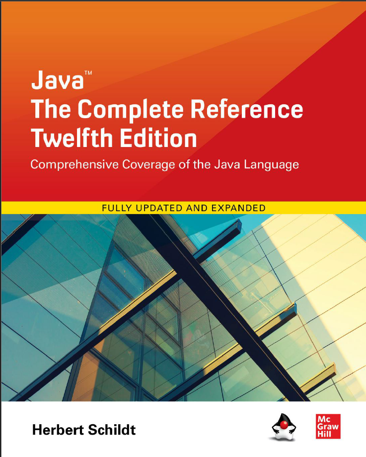

# Java: The Complete Reference, Twelfth Edition

This repo has the code example for the book.

## Chapters

| Chapter | Title                                                         | Completed |
| :-----: | ------------------------------------------------------------- |:---------:|
|         |                  **Part I: The Java Language**                |           |
|   01    | The History and Evolution of Java                             |     ✅     |
|   02    | An Overview of Java                                           |     ✅     |
|   03    | Data Types, Variables, and Arrays                             |     ✅     |
|   04    | Operators                                                     |           |
|   05    | Control Statements                                            |           |
|   06    | Introducing Classes                                           |           |
|   07    | A Close Look at Methods and Classes                           |           |
|   08    | Inheritance                                                   |           |
|   09    | Packages and Interfaces                                       |           |
|   10    | Exception Handling                                            |           |
|   11    | Multithreaded Programming                                     |           |
|   12    | Enumerations, Autoboxing, and Annotations                     |           |
|   13    | I/O, Try-with-Resources, and Other Topics                     |           |
|   14    | Generics                                                      |           |
|   15    | Lambda Expressions                                            |           |
|   16    | Modules                                                       |           |
|   17    | Switch Expressions, Records, and Other Recently Added Features|           |
|         |                   **Part II: The Java Library**               |           |
|   18    | String Handling                                               |           |
|   19    | Exploring java.lang                                           |           |
|   20    | java.util Part 1: The Collections Framework                   |           |
|   21    | java.util Part 2: More Utility Classes                        |           |
|   22    | Input/Output: Exploring java.io                               |           |
|   23    | Exploring NIO                                                 |           |
|   24    | Networking                                                    |           |
|   25    | Event Handling                                                |           |
|   26    | Introducing the AWT: Working with Windows, Graphics, and Text |           |
|   27    | Using AWT Controls, Layout Managers, and Menus                |           |
|   28    | Images                                                        |           |
|   29    | The Concurrency Utilities                                     |           |
|   30    | The Stream API                                                |           |
|   31    | Regular Expressions and Other Packages                        |           |
|         |     **Part III: Introducing GUI Programming with Swing**      |           |
|   32    | Introducing Swing                                             |           |
|   33    | Exploring Swing                                               |           |
|   34    | Introducing Swing Menus                                       |           |
|         |               **Part IV: Applying Java**                      |           |
|   35    | Java Beans                                                    |           |
|   36    | Introducing Servlets                                          |           |

